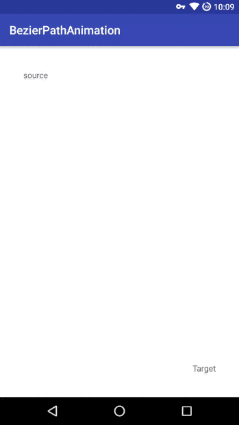

# BezierPathAnimation

贝塞尔路径动画封装(实现取自 https://github.com/AndroidStudy2015/BezierCurveAnimater)

## 使用

```java
BezierHelper.create()
    .setSource(source) // 设置动画图片来源和起始位置参考 View
    .setTarget(target) // 设置目标位置参考 View
    .setContainer(container) // 设置动画所在容器 Layout
    //.setTimeInterpolator 设置插值器，默认为加速插值器
    //.setDuration 设置动画时长，默认 800 毫秒
    //.setCompleteListener 设置动画完成监听
    .start(); // 开始动画
```

## 效果



